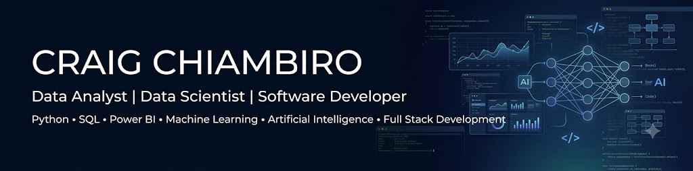

# 👋 Hi, I'm Craig Chiambiro

## 💻 Data Analyst | Data Scientist | Software Developer

I am a passionate Information Technology graduate specializing in Data Science, with a strong interest in transforming data into meaningful insights and building practical software solutions. I enjoy solving real-world problems through data analytics, machine learning, business intelligence, and modern web development.

### 🚀 Areas of Interest

- 📊 Data Analytics
- 🤖 Machine Learning
- 💻 Software Development
- 🚀 SaaS Applications
- 📈 Business Intelligence

---

# 🛠️ Technical Skills

### Programming Languages

### Data Science & Analytics

### Development Tools

---

# 🚀 Featured Projects

## 📊 Retail Sales Intelligence Dashboard

Analyze retail sales performance using Python, Pandas, Jupyter Notebook, and Power BI.

🔗 https://github.com/CraigChiambiro/FUTURE_DS_01

---

## 👥 Customer Retention & Churn Analysis

Business intelligence dashboard analyzing customer churn and retention with actionable insights.

🔗 https://github.com/CraigChiambiro/FUTURE_DS_02

---

## 📈 Marketing Funnel & Conversion Analysis

Marketing analytics project focused on customer conversion, campaign performance, and funnel optimization.

🔗 https://github.com/CraigChiambiro/FUTURE_DS_03

---

## 🤖 Machine Learning Portfolio

A collection of machine learning projects including:

- Loan Prediction
- Fraud Detection
- Bank Customer Churn Prediction
- House Price Prediction

🔗 https://github.com/CraigChiambiro

---

## 💻 Software Development Projects

Building practical applications with modern technologies.

Projects include:

- Daily Reset Productivity App
- CoupleCheck (In Development)

Tech Stack:

React • Next.js • TypeScript • Firebase • Supabase

---

## 🐍 Contribution Graph

---

# 📫 Connect With Me

**LinkedIn**  
https://www.linkedin.com/in/craig-chiambiro-6b3394257

---

⭐ **Always learning. Always building. Always improving.**
